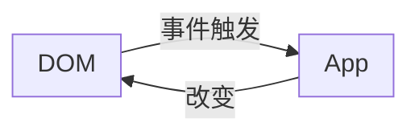

# React开发

> 什么要学习React开发？

声明式的设计、高效灵活、组件化、单向数据流、虚拟dom

> 怎样快速学习React开发？

视频+笔记+资料+文档+代码 

## 一、React 基础

### 1.React起源与发展

React起源于Facebook的内部项目，因为该公司对市场上所有JavaScript MVC框架，都不满意，就决定自己写一套，用来架设Instagram的网站。做出来以后，发现这套东西很好用，就在2013年5月开源了。

## 2.React与传统MVC的关系

轻量级的视图层图库！A javaScript libary for building user interfaces.

React 不是一个完整的MVC框架，最多可以人为是MVC中的V（View），甚至React并不非常认可MVC开发模式；React构建页面UI的库。可以简单地理解为，React将界面分成了各个独立的小块，每一个块就是组件，这些组件之间可以组合、嵌套，就成了我们的页面。

### 3.React的特性

特点：

1. 声明式的设计-React采用声明式范式，可以轻松描述应用。
2. 高效-React通过对DOM的模拟（虚拟dom），最大限度地减少与DOM的交互。
3. 灵活-React可以与已知的库或框架很好地配合。
4. JSX-JSX是JavaScript语法地扩展
5. 组件-通过React构建组件，使得代码更加容易得到服用，能够很好地应用在大项目地开发中
6. 单项响应地数据流-React实现了单向响应地数据流，从而减少了重复代码，这也是它为什么比传统数据绑定更简单。

### 4.虚拟DOM

**传统dom更新：**
真实页面对应一个DOM树。在传统页面地开发模式中，每次需要更新页面时，都要手动操作DOM来进行更新



**虚拟dom：**

DOM操作非常昂贵。我们都知道在前端开发中，性能消耗最大的就是DOM操作，而且这部分代码会让整体项目的代码变得难以维护。React把真实DOM树转换成JavaScript对象书，也就是Virtual DOM。

## 二、create-react-app

全局安装create-react-app

```shell
$ npm install -g create-react-app
```

创建一个项目

```shell
$ create-react-app your-app 注意一个命令方式

create a new React app in /dir/your-app

Installing packages. This might take a couple of minutes.
Installing react, react-dom, and react-scripts with cra-template...
```

如果不想全局安装，可以直接使用npx

```shell
$ npx create-react-app your-app 也可以实现相同的效果
```

这需要等待一段事件，这个过程实际上会安装三个东西

- react：react的顶级库
- react-dom：因为react有很多的运行环境，比如app段的react-native，我们要在web上运行使用react-dom
- react-scripts：包含运行和打包react应用程序的所有脚本及配置。

出现下面的界面，表示创建项目成功

```shell
Inside that directory, you can run several commands:

  npm start
    Starts the development server.

  npm run build
    Bundles the app into static files for production.

  npm test
    Starts the test runner.

  npm run eject
    Removes this tool and copies build dependencies, configuration files
    and scripts into the app directory. If you do this, you can’t go back!

We suggest that you begin by typing:

  cd wandering-browser
  npm start

Happy hacking!
```

目录结构

~~~text
|--README.md		使用方法的文档
|--node——modules	所有的依赖安装的目录
|--package-lock.json 锁定安装时包的版本号，保证团队的依赖能保证一致
|--package.json
|--public			静态公告开发目录
|--src				开发用的源代码目录
~~~

### 三、编写第一个react应用程序

react开发需要引入多个依赖文件：react.js、react-dom.js,分别又有开发版本和生产版本，create-react-app里已经帮我们把这些东西都安装好了，把通过CRA创建的的工程目录下的src目录清空，然后再里面重新创建一个index.js。写入以下代码：

~~~jsx
// 从 react 的包中引入了React，只要你要写 React.js 组件就必须引入 React，因为 react里有一种语法叫 JSX；要写JSX，就必须要引入 React
import React from 'react'
// ReactDOM 可以邦族我们把React组件渲染到页面上去，没有其他的作用了。它是从react-dom 中引入的，而不是从 react 引入。
import ReactDOM from 'react-dom'

// ReactDOM里有一个render方法，功能就是把组件渲染并且构造 DOM 树，然后插入到页面上某个特定的元素上
ReactDOM.render(
// 这里就比较奇怪了，它并不是一个字符串，看起来像是纯HTML代码写在 JavaScript 代码里面。语法错误吗？并不是合法的 JavaScript 代码，在 JavaScript 写的标签语法叫 JSX-JavaScript XML
    <h1>欢迎进入React的世界</h1>
// 渲染到哪里
    document.getRlementById('root');
)
~~~

## 四、JSX 语法

### 1.JSX语法

JSX将HTML语法直接加入到JavaScript代码中，再通过翻译器转换到纯JavaScript后由浏览器执行。在实际开发中，JSX在产品打包阶段都已经编译成纯JavaScript，不会带来任何副作用，反而会让代码更加直观并易于维护。编译过程由Babel的JSX编译实现。

原理是什么呢?

需要明代JSX原理,需要先明白如何用JavaScript对象来表现一个DOM元素的结构?

所谓的JSX,其实就是JavaScript对象,所以使用React和JSX的时候一定要经过编译的过程:

> JSX一使用react构造组件,bable进行编译-->JavaScript对象-->ReactDOM.render()-->DOM元素-->插入页面

### 2.Class组件

ES6的加入让JavaScript直接支持使用class来定义一个类,react创建组件的方式就是使用类的继承,ES6 class 是目前官方推荐的使用方式,它使用了ES6标准语法来构建

- es6 class组件其实就是一个构造器,每次使用组件都相当于在实例化组件

注意点:

- 组件首字母大写
- 组件只能有一个最大的闭合标签
- return后面不能直接加回车!!!可以通过()来对齐

### 3.函数组件

```js
function App(){
    return (
        <div>hello function component</div>
    )
}

/**
 * 16.8之前 无状态组件
 * 16.8之后 react hooks
 */
export default App
```

### 4.组件的嵌套

```js
import React, { Component } from 'react'

class Navbar extends Component{
    render(){
        return <div>Navbar</div>
    }
}

class Swiper extends Component{
    render(){
        return <div>Swiper</div>
    }
}

class Tabbar extends Component{
    render(){
        return <div>Tabbar</div>
    }
}

export default class App extends Component {
  render() {
    return (
      <div>
          <Navbar></Navbar>
          <Swiper></Swiper>
          <Tabbar></Tabbar>
      </div>
    )
  }
}
```

### 5.组件的样式

```js
import React, { Component } from 'react'
import '../css/index.css'

export default class App extends Component {
  render() {
      var myname = "小沈要努力呀"
      var obj = {
          backgroundColor:"red",
          fontSize:"20px"
      }
    return (
      <div> 
        {10+20}-{myname}<br/>
        {10>20?myname:"小沈"}
        <div style={{background:"yellow"}}>111111111</div>
        <div style={obj}>222222222</div>
        <div className='active'>222222222</div>
        <label htmlFor="username">用户名：</label>
        <input type="text" id='username'></input>
      </div>
    )
  }
}
```

### 6、事件处理

~~~js
import React, { Component } from 'react'

export default class App extends Component {
  a = 10
  render() {
    return (
      <div>
          <input/>
          <button onClick={
            ()=>{
              console.log("click1","如果处理逻辑过多，不推荐这种写法",this.a)
            }
          }>add1</button>
          <button onClick={this.handleClick2.bind(this)}>add2</button>
          <button onClick={this.handleClick3}>add3</button>
          <button onClick={
            ()=>{
              this.handleClick4() // 比较推荐
            }
          }>add4</button>
      </div>
    )
  }
  handleClick2(){
    console.log("click2",this.a)
  }

  handleClick3 = ()=>{
    console.log("click3",this.a)
  }

  handleClick4(){
    console.log("click4",this.a)
  }

}
~~~

说明：

- call，改变this指向，自动执行函数
- apply，改变this指向，自动执行函数
- bind，改变this指向，不会自动执行函数,手动加阔含执行函数

```js
var obj1 = {
  name:"obj1",
  getName(){
    console.log(this.name)
  }
}

var obj2 = {
  name:"obj2",
  getName(){
    console.log(this.name)
  }
}

obj1.getName.call(obj2)

obj1.getName.apply(obj2)

obj1.getName.bind(obj2)()

obj2.getName()
```

React并不会真正的绑定事件到每一个具体的dom元素上，而是采用事件代理的模式

### 7、Ref的应用

- 给标签设置ref=”username“
  - 通过这个获取this.refs.username,ref可以获取到应用的真实dom

- 给组件设置ref=”username“

  - 通过这个获取this.refs.username,ref可以获取到组件对象

- 新的写法

  ```html
  myRef = React.createRef()
  
  <div ref={this.myRef}>
      hello
  </div>
  
  访问this.myRef.current
  ```

## 五、组件的数据挂载方式

### 1、状态（state）

状态就是组件描述某种显示情况的数据，由组件自己设置和更改，也就是说由组件自己维护，使用窗台的目的就是为了在不同的状态下使组件的显示不同（自己管理）

1.**定义state**

this.state是纯js对象，在vue中，data属性是利用object.defineProperty处理过的，更改data的数据的时候会触发数据的getter和setter，但是React中美亚由做这样的处理，如果直接更改的话，react是无法得知的，所以，需要使用特色的更改状态的方法setState

2.**setState**

isLiked存放在实例state对象中，组件的render函数内，会根据组件的state中的isLiked不同显示”取消“或”收藏“内容

```js
import React, { Component } from 'react'

export default class App extends Component {

  state = {
    myShow: true
  }
  
  render() {
    return (
      <div>
        <h1>欢迎来到react开发</h1>
        <button onClick={
            ()=>{
                this.setState({
                    myShow: !this.state.myShow
                })
                if(this.state.myShow){
                    console.log("收藏的逻辑")
                }else{
                    console.log("取消收藏的逻辑")
                }
            }
        }>{this.state.myShow?'收藏':'取消收藏'}</button>
      </div>
    )
  }
}

```

原生js - map

```js
import React, { Component } from 'react'

export default class App extends Component {
  
  state = {
      list:["1111","222","333"]
  }
  render() {
    var newList = this.state.list.map(item=><li key={item}>{item}</li>)
    return (
      <div>
          <ul>
            { newList }
          </ul>
      </div>
    )
  }
}
```

## 六、axios

安装axios

```shell
npm i --save axios
```

## 七、filter

```js
var newList = this.state.cinemaList.filter(item=>item.name.includes(event.target.value))
```

## 八、setState

1、setState处在同步的逻辑中异步更新状态，更新真实dom

2、setState处在异步的逻辑中同步更新状态，更新真实dom

3、setState 接受第二个参数，第二个参数式诡吊函数，状态和dom更新完后就会被触发

## 九、BetterScroll

安装

```shell
npm i --save better-scroll
```

引入

```shell
import BetterScroll from 'better-scroll'
```

使用

```shell
  getData(){
      var list = [1,2,3,4,5,6,7,8,9,10,11,12,13,14,15]
      this.setState({
          list:list
      },()=>{
        new BetterScroll(".wrapper")
      })
    }
```

## 十、属性（props）

props正常是外部传入的，组件内部也可以通过一些方式来初始化的设置，属性不能被组件自己更改，但是你可以通过父组件主动重新渲染的方式来传入新的props

属性是描述性质、特点的，组件自己不能随意更改。

之前的组件代买里面由props的简单使用，总的来说，在使用一个组件的时候，可以把参数放在标签的属性当中，所有的属性都会作为组件props对象的键值。通过箭头函数创建的组件，需要通过函数的参数来接受props

1. 在组件上通过key=value写属性，通过this.props获取取属性，这样组件的可复用性提高了
2. 注意在传参数的时候，如果写成isShow="true"，那么这是一个字符串，如果写成isShow={true}，这个是布尔值
3. {...对象} 展开赋值
4. 默认赋值
5. prop-types 属性验证


```js
import ReactPropTypes from 'prop-types'

//类属性
Navbar.propTypes = {
  title: ReactPropTypes.string,
  leftshow: ReactPropTypes.bool
}
```


默认值

```js
// 默认值
Navbar.defaultProps = {
  leftshow:true
}

```


转换 ==>static


### 属性VS状态

相似点：都是纯js对象，都会触发render更新，都具有确定性（状态/属性相同，结果相同）

不同点：

1. 属性能从父组件获取，状态不能

2. 属性可以由父组件修改，状态不能

3. 属性能在内部设置默认值，状态也可以，设置方式不一样

4. 属性不在组件内部修改，状态要在组件内部修改

5. 属性能设置子组件初始值，状态不可以

6. 属性可以修改子组件的值，状态不可以

   state的主要作用式用于组件保存、控制、修改自己的可变状态。state在组件内部初始化，可以被组件自身修改，而外部不能访问也不能修改。你可以认为state是一个局部的，只能被组件自身控制的数据源。state中状态可以通过this.setState方法进行更新，setState会导致组件的重新渲染。

   props的主要作用是让使用该组件的父组件可以传入参数来配置该组件。它是外部传进来的配置参数，组件内部无法控制也无法修改。除非外部组件主动传入新的props，否则组件的props永远保持不变。

   没有state的组件叫无状态组件（stateless component），设置了state的叫做有状态组件（stateful component）。因为状态会带来管理的复杂性，我们尽量多写无状态组件，尽量少些有状态的组件。这样会降低代码维护的难度，也会在一定程度上增强组件的可复用性。

## 表单的受控与非受控

```js
import React, { Component } from 'react'

export default class App extends Component {
  state = {
      username:"沈金勇"
  }
  render() {
    return (
      <div>
          <h1>登录页</h1>
          <input type="text"value={this.state.username} onChange={
              (evt)=>{
                  this.setState({
                      username: evt.target.value
                  })
              }
          }></input>
          <button onClick={()=>{
             console.log(this.state.username)
          }}>登录</button>
          <button onClick={()=>{
                this.setState({
                    username: ""
                })
          }}>重置</button>
      </div>
    )
  }
}

```


## 二、React Hooks

## 三、React 路由

## 四、React Redux

## 五、组件库

## 六、Immutable

## 七、Mobx

## 八、React+TS

## 九、单元测试

## 十、dva+umi