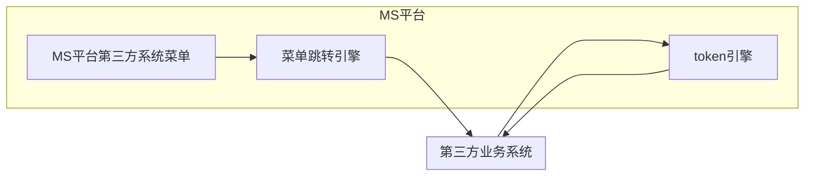

# 单点登录功能

## 一、准备工作

1. 同步平台用户数据

2. 同步平台组织架构数据

3. 第三方系统内网完整的访问地址
4. 第三方系统外网完整的访问地址

说明：提供访问url后，平台管理员会提供一个对应的平台测试用户、用户密码、系统跳转菜单

## 二、机制原理及验证说明

### 2.1 机制原理说明




1. 点击第三方业务系统菜单跳转到菜单引擎(MS平台的菜单跳转引擎根据单点登录第三方系统请求地址配置表的内外网地址配置数据自动解释选择访问内网还是外网及根据当前登录人信息生成token)
2. 携带token参数请求第三方单点登录接口
3. 请求token引擎的验证接口进行token有效性的验证
4. token验证结果：验证通过或验证失败;业务系统根据验证结果进行二次验证、放行进入系统

说明：业务系统是否需要同步MS平台的用户、机构信息用于单签登录的二次验收，此操作不做强制要求，但为了系统安全性考虑，建议做二次用户信息验收

### 2.2 token验证说明

1. MS平台由第三方系统提供的url+平台生成的token跳转到url地址
2. 第三方系统调用MS平台验证接口校验token有效性（**超过30分钟则失效**），验证通过后返回验证结果，验证成功则返回验证成功参数（验证成功参数中包含当前平台登录用户的登录id），同时第三方系统可以根据当前验证成功参数来验证当前平台登录用户id的有效性，有效则登录成功，否则反之。

Token数据：司法平台登录用户名+密码+生成token时间戳

Token加密：采用AES加密算法

## 三、Token验证接口

### 3.1 验证接口地址

外网验证地址：http://ip:port/url

内网验证地址：http://ip:port/url

### 3.2 接口实现方式

说明：采用HTTP标准的POST协议

**1、输入参数**

参数名：token

正确输入样例

```json
{
	token:token值
}
```

**2、返回结果**

成功结果样例（status>0为验证成功，反之为验证失败）

```json
{
    message:"token验证通过",
    status:"1",
    loginid:"admin"
}
```

失败结果样例

```json
{
    message:"token验证失败，该token已经失效",
    status:"-1"
}
```

## 四、解决方案

1. 平台需要对接广西政务网接入的一个第三方入口，我们系统会将用户信息推送至该服务

2. 用户在该服务登录之后，前端要暴露一个类似于登录的访问路径，该服务上已经登录的用户会经这个入口访问这个暴露的路径，前端将该token传至后台
3. 后台回调该系统提供的token服务获取用户信息，并取到该用户在我们系统上的用户信息，后台根据这份用户信息调用登录的接口，并返回我们系统上的token至定制的页面
4. 页面根据该token数据按照原来工具上登录后的数据架子加载数据

## 五、具体实现

### 5.1 封装登录结果

```java
@Data
@AllArgsConstructor
@NoArgsConstructor
public class UserLoginResultDTO {
    private boolean success;
    private String code;
    private String message;
    private UserInfoResult result;
    
    @Data
    @AllArgsConstructor
    @NoArgsConstructor
    private class UserInfoResult {
        private String tokenId;
        private String userId;
        private Integer expireTime;
        private String longToken;
        private UserInfo userInfo;
    }

}


```

### 5.2 封装http请求

~~~java
/**
 * @Classname HttpPostUtil
 * @Description 基于HTTP提交数据的相关函数
 * @Date 2022/2/21 13:44
 * @Created by shenjinyong
 */
public class HttpPostUtil {

    /**
     * 方法名：getHttpConnection
     * @param	url，	 		传入访问URL，例如：http://127.0.0.1:8080/ms/base/mgrmenu/gobal_getServerDate.do
     * @param	host			传入主机，例如 127.0.0.1:8080
     * @param	cookieStr		传入cookies值
     * @param	refererUrl		传入上一访问地址,如果没有直接传入访问地址即可，例如：http://127.0.0.1:8080/ms/base/mgrmenu/gobal_getServerDate.do
     * @param	postStr			传入Post方式提交的数据
     * @return HttpURLConnection
     * 作用说明：此函数的作用是根据参数，返回已建立HTTP连接
     */
    private HttpURLConnection getHttpConnection(String url, String host, String cookieStr, String refererUrl, String postStr)
            throws Exception {
        HttpURLConnection httpurlconnection = null;
        try {
            URL urlObj = new URL(url);
            httpurlconnection = (HttpURLConnection) urlObj.openConnection();
            httpurlconnection.setRequestProperty("User-Agent","Mozilla/4.0 (compatible; MSIE 6.0; Windows NT 5.1; SV1; Foxy/1; .NET CLR 2.0.50727;MEGAUPLOAD 1.0)");
            if (host != null) {
                httpurlconnection.setRequestProperty("Host", host);
            }
            if (cookieStr != null) {
                httpurlconnection.setRequestProperty("Cookie", cookieStr);
            }
            if (refererUrl != null) {
                httpurlconnection.setRequestProperty("Referer", refererUrl);
            }
            if (postStr != null) {
                HttpURLConnection.setFollowRedirects(true);
                httpurlconnection.setInstanceFollowRedirects(true);
                httpurlconnection.setDoOutput(true);
                httpurlconnection.setDoInput(true);
                httpurlconnection.setUseCaches(false);
                httpurlconnection.setAllowUserInteraction(false);
                httpurlconnection.setRequestMethod("POST");
                httpurlconnection.addRequestProperty("Accept","image/gif, image/x-xbitmap, image/jpeg, image/pjpeg, application/x-shockwave-flash, application/msword, application/vnd.ms-excel, application/vnd.ms-powerpoint, application/x-silverlight, */*");
                httpurlconnection.setRequestProperty("Accept-Language", "zh-cn");
                httpurlconnection.setRequestProperty("Content-Type","application/x-www-form-urlencoded; charset=UTF-8");
                httpurlconnection.setRequestProperty("Accept-Encoding","gzip, deflate");
                httpurlconnection.setRequestProperty("Content-Length", postStr.length() + "");
                httpurlconnection.setRequestProperty("Connection", "Keep-Alive");
                httpurlconnection.setRequestProperty("Cache-Control", "no-cache");
                httpurlconnection.getOutputStream().write(postStr.getBytes("UTF-8"));
                httpurlconnection.getOutputStream().flush();
                httpurlconnection.getOutputStream().close();
            }
            return httpurlconnection;
        } catch (Exception e) {
            throw e;
        }
    }

    /**
     * 方法名：postData
     * @param	url，	 		传入访问URL，例如：http://127.0.0.1:8080/ms/base/mgrmenu/gobal_getServerDate.do
     * @param	host			传入主机，例如 127.0.0.1:8080
     * @param	cookie			传入cookies值
     * @param	reurl			传入上一访问地址
     * @param	postStr			传入Post方式提交的数据
     * @return boolean
     * 作用说明：此函数的作用是根据参数，建立HTTP连接,模拟提交MS平台
     */
    public String postData(String url, String host, String cookie, String reurl, String postStr){
        HttpURLConnection httpurlconnection = null;
        String strLine = null;
        try {
            httpurlconnection = getHttpConnection(url, host, cookie, reurl, postStr);
            httpurlconnection.connect();

            InputStream urlStream = httpurlconnection.getInputStream();
            BufferedInputStream buff = new BufferedInputStream(urlStream);
            Reader r = new InputStreamReader(buff, "UTF-8");
            BufferedReader br = new BufferedReader(r);
            StringBuffer strHtml = new StringBuffer("");
            while ((strLine = br.readLine()) != null) {
                strHtml.append(strLine + "\r\n");
            }
            if(strHtml.length() > 0)strLine = strHtml.toString();
            httpurlconnection.disconnect();
        } catch (Exception e) {
            try {
                throw new Exception("提交错误：发送到服务端失败！原因：" + e.getMessage(), e);
            } catch (Exception exception) {
                exception.printStackTrace();
            }
        } finally {
            if (httpurlconnection != null)
                httpurlconnection.disconnect();
        }
        return strLine;
    }

}
~~~

### 5.3 封装校验token方法

说明：第三方的数据默认时不安全和不合法的，需要兼容异常情况！！！

```java
@Service
public class TokenServiceImpl implements TokenService {

    @Value("${sso.serverHost}")
    private String serverHost;

    @Value("${sso.postUrl}")
    private String postUrl;
    
    public HttpResult verifyToken(String token){
        HttpPostUtil httpObj = new HttpPostUtil();
        String postStr = "token="+token;
        String result = httpObj.postData(postUrl, serverHost, "", postUrl, postStr);
        return JSONObject.parseObject(result, HttpResult.class);
    }

}
```

### 5.4 本地登录服务

~~~java
@Service
public class LoginServiceImpl implements LoginService {
    
    @Autowired
    private UserAccountServiceImpl userAccountService;
    
    public UserLoginResultDTO LoginByLoginId(String loginid){
        log.info("token验证成功,loginid:" + loginid);
        UserLoginResultDTO userLoginResultDTO = null;
        UserAccountDTO userAccountDTO = userAccountService.selectByLoginname(loginid);
        if(userAccountDTO != null){
            // 存储账号、密码和客户端类型
            Map<String, String> loginMap = new HashMap<>();
            loginMap.put("username", userAccountDTO.getLoginname());
            loginMap.put("password", userAccountDTO.getPassword());
            loginMap.put("clientType", clientType);
            // 发送本地登录请求
            String responseStr = HttpClientUtil.doPostFormData(url, loginMap);
            log.info("发送本地登录请求返回结果：{}",responseStr);
            userLoginResultDTO = JSONObject.parseObject(responseStr, UserLoginResultDTO.class);
        }
        return userLoginResultDTO;
    }

}
~~~


### 5.4 token登录服务

```java
@RestController
@Slf4j
public class LoginController {

    @Autowired
    private TokenServiceImpl tokenService;
    
    @Autowired
    private LoginServiceImpl loginService;

    /**
     * 客户端类型
     * */
    @Value("${sso.clientType}")
    private String clientType;

    /**
     * 本地登录地址
     * */
    @Value("${sso.url}")
    private String url;

    @PostMapping("/login")
    public UserLoginResultDTO login(@RequestBody Map<String,String> tokenMap){
        // 第三方ms平台处理
        log.info("收到第三方传递过来的token:" + tokenMap.get("token"));
        HttpResult httpResult = tokenService.verifyToken(tokenMap.get("token"));
        log.info("验证第三方token返回的结果:" + httpResult);
        // 本地登录处理
        UserLoginResultDTO userLoginResultDTO = null;
        if("1".equals(httpResult.getStatus())){
            String loginid = httpResult.getLoginid();
            userLoginResultDTO = loginService.LoginByLoginId(loginid);
        }else{
            log.info("第三方token验证失败，原因：" + httpResult.getMessage());
            userLoginResultDTO = new UserLoginResultDTO(Boolean.FALSE,"500","单点登录第三方token验证失败，请联系管理员",null);
        }
        return userLoginResultDTO;
    }

}
```

## 六、优化部分

第三方的数据默认时不安全和不合法的，需要兼容异常情况！！！
