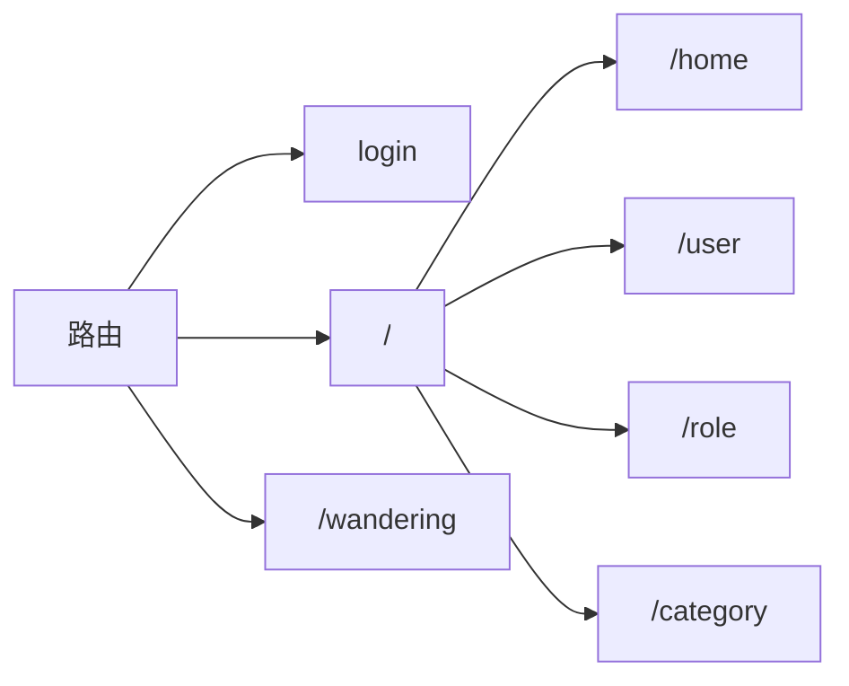

# 后台管理系统

- react hooks

- react router

- react redux

- antd组件库

## 前期准备

### 安装

```shell
npx create-react-app wandering-admin

cd wandering-admin

npm start
```

### 项目sass

```shell
npm i --save sass
```

### Axios请求

```shell
npm i --save axios
```

### 跨域处理

安装

```shell
# 全环境
npm i --save http-proxy-middleware

# 开发环境
npm i --save-dev http-proxy-middleware
```

src/setupProxy.js

```js
const { createProxyMiddleware } = require('http-proxy-middleware');

module.exports = function(app){
    app.use(
        '/wandering/v1',
        createProxyMiddleware({
            target:'http://localhost:8888/wandering/v1',
            changeOrigin:true
        })
    )
}
```

## 路由架构



安装路由

```shell
npm i --save react-router-dom
```

使用路由

router/indexRouter.js

```js
import React from 'react'
import { HashRouter, Routes,Route, Navigate } from 'react-router-dom'

import Login from '../views/login/Login'
import Admin from '../views/admin/Admin'

export default function indexRouter() {
  return (
    <HashRouter>
      <Routes>
        <Route path='/login' element={<Login/>}></Route>
        {/* <Route path='/' element={<Admin/>}></Route> */}
        <Route path='/' element={
          localStorage.getItem("toekn")?<Admin/>:<Navigate to="/login" replace />
        }></Route>
      </Routes>
    </HashRouter>
  )
}
```

App.js

```js
import IndexRouter from "./router/indexRouter";

function App() {
  return (
    <div>
      <IndexRouter></IndexRouter>
    </div>
  );
}

export default App;
```

## 搭建路由

Admin.js

```js
import React from 'react'
import { Outlet } from 'react-router-dom'

import SideMenu from '../../components/admin/SideMenu'
import TopHeader from '../../components/admin/TopHeader'
export default function Admin() {
  return (
    <div>
      <SideMenu></SideMenu>
      <TopHeader></TopHeader>
      <Outlet/>
    </div>
  )
}
```

IndexRouter.js

```js
import React from 'react'
import { HashRouter, Routes,Route, Navigate } from 'react-router-dom'

import Login from '../views/login/Login'
import Admin from '../views/admin/Admin'

export default function indexRouter() {
  return (
    <HashRouter>
      <Routes>
        <Route path='login' element={<Login/>}></Route>
        {/* <Route path='/' element={<Admin/>}></Route> */}
        <Route path='/' element={
          // localStorage.getItem("toekn")?<Admin/>:<Navigate to="/login" replace />
          true?
          <Admin></Admin>:<Navigate to="login" replace />
        }>
          <Route path='home' element={<div>home</div>}></Route>
          <Route path='user' element={<div>user</div>}></Route>
          <Route path='role' element={<div>role</div>}></Route>
        </Route>
        <Route path='*' element={<div>403</div>} />
      </Routes>
    </HashRouter>
  )
}
```

## Ant Design

安装

```shell
npm i --save antd
```

App.css

```css
@import 'antd/dist/antd.min.css'
```

App.js

```js
import IndexRouter from "./router/indexRouter";
import './App.css'
function App() {
  return (
    <IndexRouter></IndexRouter>
  );
}

export default App;
```

## Layout布局

TopHeader.js

```js
import React ,{ useState } from 'react'

import { Layout } from 'antd';

import {
  MenuUnfoldOutlined,
  MenuFoldOutlined,
} from '@ant-design/icons';

const { Header } = Layout;

export default function TopHeader() {

  const [collapsed] = useState(false)
  
  return (
    <Header className='site-layout-background' style={{ padding: '0 16px' }}>
            {
              collapsed?<MenuUnfoldOutlined/> : <MenuFoldOutlined/>
            }
    </Header>
  )
}

```

SideMenu.js

```js
import React from 'react'

import { Layout, Menu } from 'antd'

import {
  UserOutlined,
  VideoCameraOutlined,
  UploadOutlined,
} from '@ant-design/icons'

const { Sider } = Layout

export default function SideMenu() {
  return (
    <Sider trigger={null} collapsible >
          <div className="logo" />
          <Menu
            theme="dark"
            mode="inline"
            defaultSelectedKeys={['1']}
            items={[
              {
                key: '1',
                icon: <UserOutlined />,
                label: 'nav 1',
              },
              {
                key: '2',
                icon: <VideoCameraOutlined />,
                label: 'nav 2',
              },
              {
                key: '3',
                icon: <UploadOutlined />,
                label: 'nav 3',
              },
            ]}
          />
        </Sider>
  )
}
```

Admin.css

```css
#components-layout-demo-custom-trigger .trigger {
    padding: 0 24px;
    font-size: 18px;
    line-height: 64px;
    cursor: pointer;
    transition: color 0.3s;
  }
  
#components-layout-demo-custom-trigger .trigger:hover {
    color: #1890ff;
}

#components-layout-demo-custom-trigger .logo {
    height: 32px;
    margin: 16px;
    background: rgba(255, 255, 255, 0.3);
}

.site-layout .site-layout-background {
    background: #fff;
}

#root,.ant-layout{
    height: 100%;
}
```

Admin.js

```js
import React from 'react'
import { Outlet } from 'react-router-dom'

import SideMenu from '../../components/admin/SideMenu'
import TopHeader from '../../components/admin/TopHeader'

import { Layout } from 'antd'
import './Admin.css'

const { Content } = Layout

export default function Admin() {
  return (
    <Layout>
      <SideMenu></SideMenu>
      <Layout className="site-layout">
        <TopHeader></TopHeader>
        <Content
            className="site-layout-background"
            style={{
              margin: '24px 16px',
              padding: 24,
              minHeight: 280,
            }}
          >
          <Outlet/>
        </Content>
      </Layout>
    </Layout>
  )
}

```

## TopHeader组件

后续使用组件通信使用react-redux

修改组件图标

增加用户信息

TopHeader.js

```js
import React ,{ useState } from 'react'

import { Layout, Menu, Dropdown,Avatar } from 'antd';

import {
  MenuUnfoldOutlined,
  MenuFoldOutlined,
  SmileOutlined,
  UserOutlined
} from '@ant-design/icons';

const { Header } = Layout;

export default function TopHeader() {

  const [collapsed,setCollapsed] = useState(false)
  
  const changeCollapsed = ()=>{
    setCollapsed(!collapsed)
  }

  const menu = (
    <Menu
      items={[
        {
          label: (
            <a target="_blank" rel="noopener noreferrer" href="https://www.antgroup.com">
              超级管理员
            </a>
          ),
        },
        {
          label: (
            <a target="_blank" rel="noopener noreferrer" href="https://www.aliyun.com">
              禁用
            </a>
          ),
          icon: <SmileOutlined />,
          disabled: true,
        },
        {
          danger: true,
          label: '退出',
        },
      ]}
    />
  )

  return (
    <Header className='site-layout-background' style={{ padding: '0 16px' }}>
            {
              collapsed?<MenuUnfoldOutlined onClick={changeCollapsed}/> : <MenuFoldOutlined onClick={changeCollapsed}/>
            }
            <div style={{float:'right'}}>
              <span>欢迎admin回来</span>
              <Dropdown overlay={menu}>
                <Avatar size="large" icon={<UserOutlined />} />
              </Dropdown>
            </div>
    </Header>
  )
}

```

## SideMenu组件

